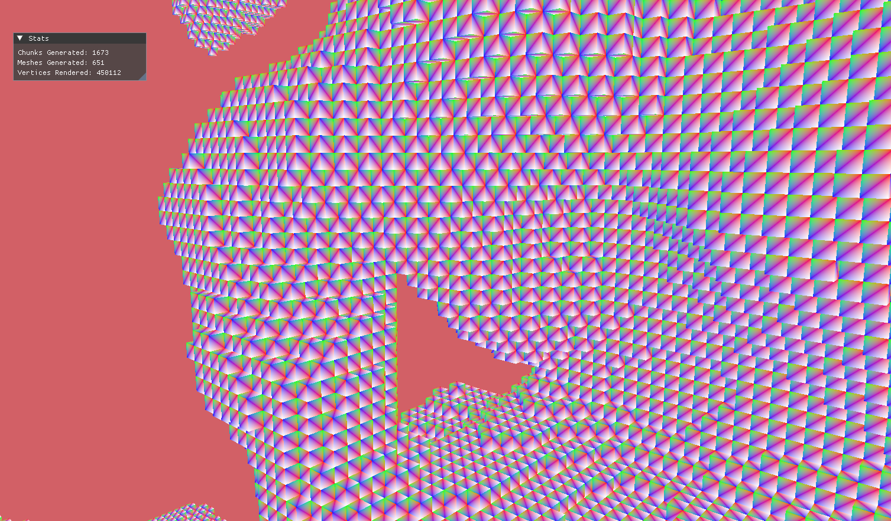

# Moxel Engine
Vulkan based voxel rendering engine written with SDL

# Build
Current build support is Windows only

## Windows
You can use CLion or Visual Studio with Ninja for building

* Clone the repository using ```git clone --recursive https://github.com/Arimekiku/MoxelEngine```
* Hit the build button and wait

# Implemented Features
The Engine is in a pretty raw stage, but it already has:

## Engine Features
There listed all capabilities engine supports at the moment

* Compile time SPIRV
* All the preparation needed for vulkan API
* Simple buffer allocations
* Vertex/Uniform/Index buffer objects

## Application Features
* Perspective camera object
* Fully functional scene based on voxels with chunks and multithreading



# TODO
* Texturing
* Cubemaps
* Mesh-Importer
* Asset manager